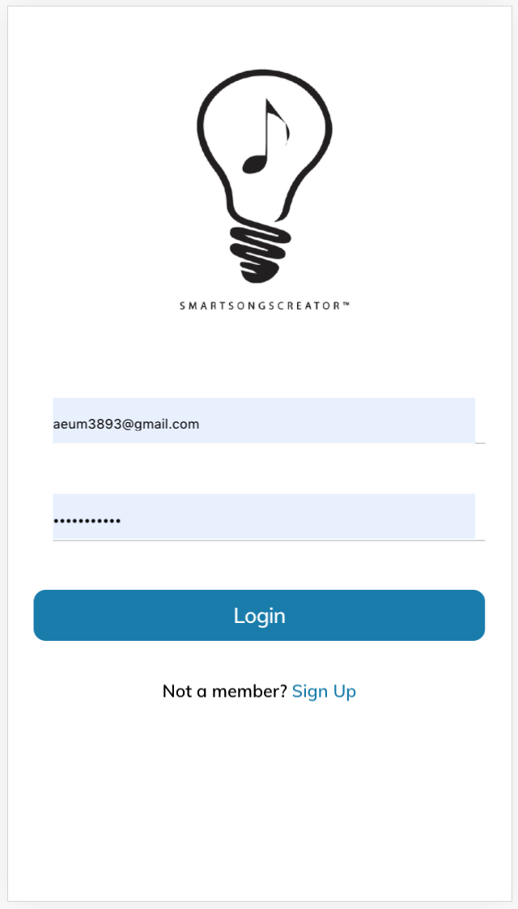
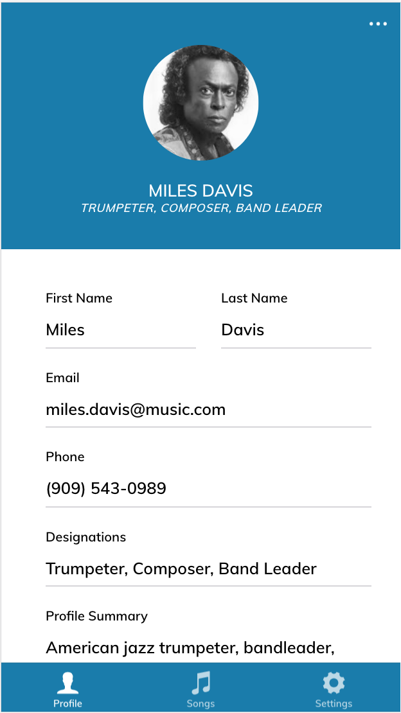
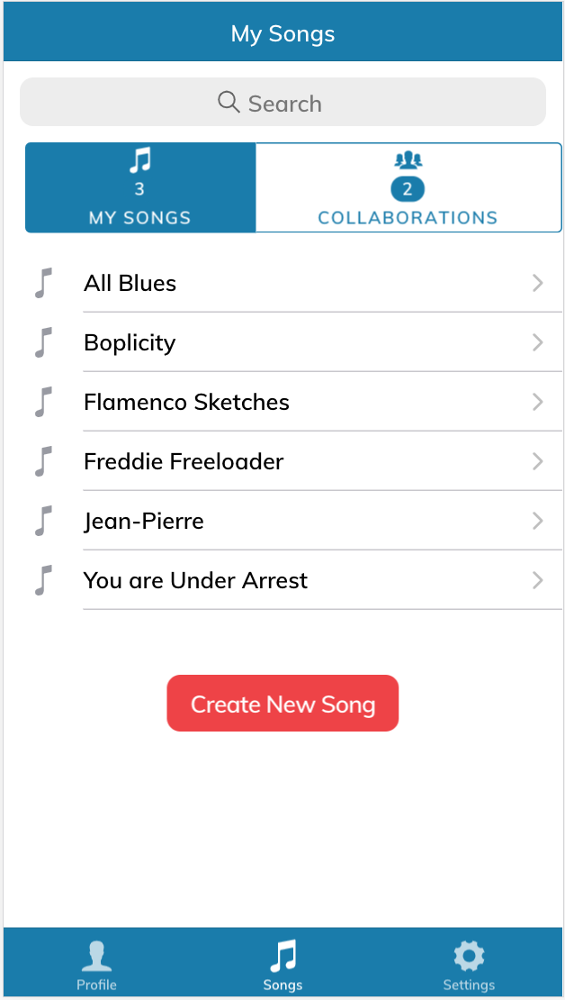
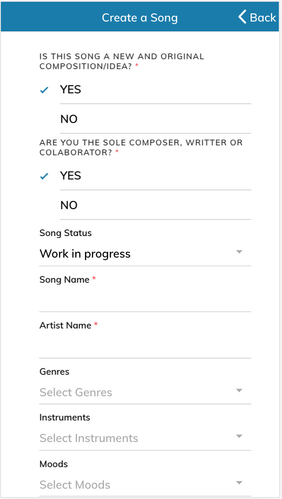

## Angular/Ionic App

Front End Mobile App that BiscayneDevs developed for client (still under construction)

### Usage in browser

- yarn
- yarn start `ng serve`

### Usage in Android Studio

- yarn
- ionic cordova prepare android
- ionic cordova run android -l

## Screenshots

### Login

### Profile

### Songs

### Songs Form (create song)

